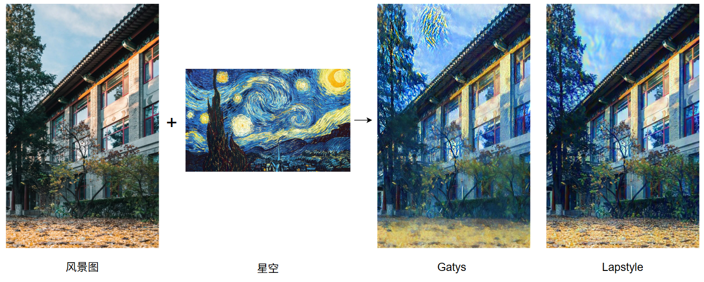

# Neural Style Transfer - Milestone

**作者：** 高润宇、董彦嘉、颜锦阳

---

## 一、问题陈述

**核心任务:** 基于PyTorch和预训练VGG19网络,实现并比较Gatys与LapStyle算法,重点关注风格迁移质量、内容结构保留能力和训练效率。

**数据集:**

- 内容图像: 北京大学景观摄影(教学楼、未名湖等),800px长边
- 风格图像: 经典艺术风格油画(梵高《星空》、莫奈作品等)

**评估指标:**

- 定性: 视觉质量、风格一致性、细节清晰度
- 定量: 内容/风格损失收敛曲线、生成时间

---

## 二、技术方法

### 2.1 Gatys方法

- 使用VGG19多层特征提取内容(conv4_2)与风格(conv1_1至conv5_1)
- 损失函数: 内容损失 + Gram矩阵风格损失 + TV正则化
- Adam优化器,学习率0.2,700轮迭代

### 2.2 LapStyle方法

- **两阶段策略:**
    - Drafting: 低分辨率(400×600)快速建立全局风格,400轮
    - Revision: 高分辨率(800×1200)精细化,引入**拉普拉斯损失**保留边缘结构,600轮
- **核心创新:** 拉普拉斯算子约束防止物体轮廓模糊

---

## 三、中期进展

**Gatys方法:**

- 风格迁移充分,笔触纹理明显
- 问题: 建筑边缘模糊,细节丢失,色彩不稳定

**LapStyle方法:**

- 边缘锐化显著,轮廓清晰，风格与内容融合更自然
- 问题：训练时间较长

---

## 四、后续工作

### 4.1 优化计划

1. **参数调优:** 网格搜索最优权重配比,测试不同分辨率策略
2. **效率提升:** 探索轻量化网络替代VGG19,研究快速前馈方法
3. **算法改进:** 引入自适应权重,探索多风格融合

### 4.2 实验扩展

- 扩大测试集至30+组场景与风格组合
- 开发Web演示界面,提升用户交互体验